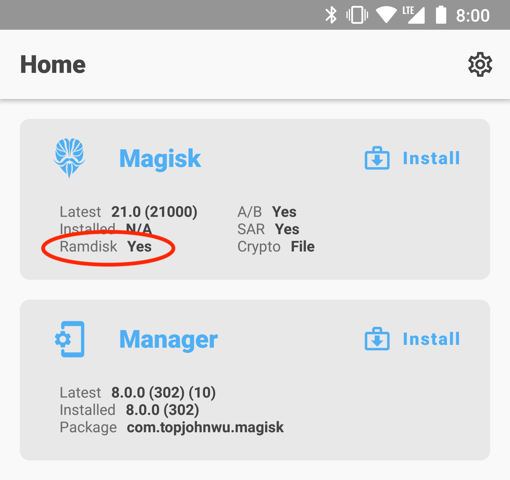

# Installation

If you already have Magisk installed, it is **strongly recommended** to upgrade directly via the Magisk app using its "Direct Install" method. The following tutorial is only for the initial installation.

## Getting Started

Before you start:

- This tutorial assumes you understand how to use `adb` and `fastboot`
- If you plan to also install custom kernels, install it after Magisk
- Your device's bootloader has to be unlocked

---

Download and install the latest [Magisk app](https://github.com/topjohnwu/Magisk/releases/latest). In the home screen, you should see:

The result of **Ramdisk** determines whether your device has ramdisk in the boot partition. If your device does not have boot ramdisk, read the [Magisk in Recovery](#magisk-in-recovery) section before continuing.

> _(Unfortunately, there are exceptions as some devices' bootloader accepts ramdisk even if it shouldn't. In this case, you will have to follow the instructions as if your device's boot partition **does** include ramdisk. There is no way to detect this, so the only way to know for sure is to actually try. Fortunately, as far as we know, only some Xiaomi devices are known to have this property, so most people can simply ignore this piece of information.)_

If you are using a Samsung device, you can now jump to [its own section](#samsung-devices).

If your device has boot ramdisk, get a copy of the `boot.img` (or `init_boot.img` if exists). 
If your device does **NOT** have boot ramdisk, get a copy of the `recovery.img`. 
You should be able to extract the file you need from official firmware packages or your custom ROM zip.

Quick recap, at this point, you should have known and prepared:

1. Whether your device has boot ramdisk
2. A `boot.img`, `init_boot.img` or `recovery.img` based on (1)

Let's continue to [Patching Images](#patching-images).

## Patching Images

- Copy the boot/init_boot/recovery image to your device
- Press the **Install** button in the Magisk card
- If you are patching a recovery image, check the **"Recovery Mode"** option
- Choose **"Select and Patch a File"** in method, and select the boot/init_boot/recovery image
- Start the installation, and copy the patched image to your PC using ADB: 
  `adb pull /sdcard/Download/magisk_patched_[random_strings].img`
- Flash the patched boot/init_boot/recovery image to your device; 
  for most devices, reboot into fastboot mode and flash with command: 
  `fastboot flash boot /path/to/magisk_patched_[random_strings].img` or  
  `fastboot flash init_boot /path/to/magisk_patched.img_[random_strings]` or  
  `fastboot flash recovery /path/to/magisk_patched.img_[random_strings]`,  
- (Optional) If your device has a separate `vbmeta` partition, you can patch the `vbmeta` partition with command: 
  `fastboot flash vbmeta --disable-verity --disable-verification vbmeta.img` (note that it may **wipe your data**)
- Reboot and launch Magisk app (you will see a stub Magisk app if you have wiped your data; use it to bootstrap to a complete Magisk app), and you will see a prompt asking for environment fix; click and wait for the reboot
- Voila!

> Warning: **NEVER** flash patched image shared by others or patch image on another device even if they have the same device model! You may need to do a full data wipe to recover your device. **ALWAYS** patch boot image **on the same device where you want to install Magisk**.

## Uninstallation

The easiest way to uninstall Magisk is directly through the Magisk app. If you insist on using custom recoveries, rename the Magisk APK to `uninstall.zip` and flash it like any other ordinary flashable zip.

## Magisk in Recovery

In the case when your device does not have ramdisk in boot images, Magisk has no choice but to hijack the recovery partition. For these devices, you will have to **reboot to recovery** every time you want Magisk enabled.

When Magisk hijacks the recovery, there is a special mechanism to allow you to _actually_ boot into recovery mode. Each device model has its own key combo to boot into recovery, as an example for Galaxy S10 it is (Power + Bixby + Volume Up). A quick search online should easily get you this info. As soon as you press the key combo and the device vibrates with a splash screen, release all buttons to boot into Magisk. If you decide to boot into the actual recovery mode, **long press volume up until you see the recovery screen**.

As a summary, after installing Magisk in recovery **(starting from power off)**:

- **(Power up normally) → (System with NO Magisk)**
- **(Recovery Key Combo) → (Splash screen) → (Release all buttons) → (System with Magisk)**
- **(Recovery Key Combo) → (Splash screen) → (Long press volume up) → (Recovery Mode)**

(Note: You **CANNOT** use custom recoveries to install or upgrade Magisk in this case!!)

## Samsung Devices

Before proceeding, please acknowledge that:

- Installing Magisk **WILL** trip your Knox Warranty Bit, this action is not reversible in any way.
- Installing Magisk for the first time **REQUIRES** a full data wipe (this is **NOT** counting the data wipe when unlocking bootloader). Please make a backup your data.

### Flashing Tools

- [Samsung Odin3](https://dl2018.sammobile.com/Odin.zip) (Windows only) (requires [Samsung USB Drivers](https://developer.samsung.com/android-usb-driver))
- [Samsung Odin4](https://forum.xda-developers.com/t/official-samsung-odin-v4-1-2-1-dc05e3ea-for-linux.4453423/) (Linux only)
- [Heimdall](https://www.glassechidna.com.au/heimdall/) (or [Grimler's fork](https://git.sr.ht/~grimler/Heimdall))

### Requirements

To verify whether or not Magisk can be installed in your Samsung device, you first must check the OEM Lock and KnoxGuard (RMM) status, to do so boot your device in Download mode with its key combo.

Possible OEM Lock values are the following:
- **ON (L)**: fully locked.
- **ON (U)**: bootloader locked, OEM unlocking enabled.
- **OFF (U)**: fully unlocked.

To unlock your bootloader, follow the instructions below. If no OEM Lock value is shown in Download mode, your device is probably not unlockable due to market limitations (USA/Canada devices).

Possible KnoxGuard values are the following:

- `Active`, `Locked`: your device has been remotely locked by your telecom operator or your insurance company.
- `Prenormal`: your device is temporarily locked, reaching 168h of uptime should trigger unlock.
- `Checking`, `Completed`, `Broken`: your device is unlocked.

Having KnoxGuard active will prevent you from installing/running Magisk regardless of your bootloader lock state.

### Unlocking the bootloader

- Allow bootloader unlocking in **Developer options → OEM unlocking**
- Reboot to download mode: power off your device and press the download mode key combo for your device
- Long press volume up to unlock the bootloader. **This will wipe your data and automatically reboot.**
- Go through the initial setup. Skip through all the steps since data will be wiped again in later steps. **Connect the device to Internet during the setup.**
- Enable developer options, and **confirm that the OEM unlocking option exists and is grayed out.** This means KnoxGuard hasn't locked your device.
- Your bootloader now accepts unofficial images in download mode

### Instructions

- Download the latest firmware package for your device, you can use one of the tools below to download it directly from Samsung servers:
  - [SamFirm.NET](https://github.com/jesec/SamFirm.NET), [samfirm.js](https://github.com/jesec/samfirm.js)
  - [Frija](https://forum.xda-developers.com/s10-plus/how-to/tool-frija-samsung-firmware-downloader-t3910594)
  - [Samloader](https://forum.xda-developers.com/s10-plus/how-to/tool-samloader-samfirm-frija-replacement-t4105929)
  - [Bifrost](https://forum.xda-developers.com/t/tool-samsung-samsung-firmware-downloader.4240719/)
- Unzip the firmware and copy the `AP` tar file to your device. It is normally named as `AP_[device_model_sw_ver].tar.md5`
- Press the **Install** button in the Magisk card
- If your device does **NOT** have boot ramdisk, check the **"Recovery Mode"** option
- Choose **"Select and Patch a File"** in method, and select the `AP` tar file
- Start the installation, and copy the patched tar file to your PC using ADB: 
  `adb pull /sdcard/Download/magisk_patched_[random_strings].tar` 
  **DO NOT USE MTP** as it is known to corrupt large files.
- Reboot to download mode. Open Odin on your PC, and flash `magisk_patched.tar` as `AP`, together with `BL`, `CP`, and `CSC` (**NOT** `HOME_CSC` because we want to **wipe data**) from the original firmware.
- Your device should reboot automatically once Odin finished flashing. **Agree to do a factory reset if asked.**
- If your device does **NOT** have boot ramdisk, reboot to recovery now to enable Magisk (reason stated in [Magisk in Recovery](#magisk-in-recovery)).
- Install the Magisk app you've already downloaded and launch the app. It should show a dialog asking for additional setup.
- Let the app do its job and automatically reboot the device. Voila!

### Upgrading the OS

Once you have rooted your Samsung device, you can no longer upgrade your Android OS through OTA. To upgrade your device's OS, you have to manually download the new firmware zip file and go through the same `AP` patching process written in the previous section. **The only difference here is in the Odin flashing step: do NOT use the `CSC` tar, but instead use the `HOME_CSC` tar as we are performing an upgrade, not the initial install**.

### Important Notes

- **Never, ever** try to restore either `boot`, `init_boot`, `recovery`, or `vbmeta` partitions back to stock! You can brick your device by doing so, and the only way to recover from this is to do a full Odin restore with data wipe.
- To upgrade your device with a new firmware, **NEVER** directly use the stock `AP` tar file with reasons mentioned above. **Always** patch `AP` in the Magisk app and use that instead.

## Custom Recovery

> **This installation method is deprecated and is maintained with minimum effort. YOU HAVE BEEN WARNED!**

Installing using custom recoveries is only possible if your device has boot ramdisk. Installing Magisk through custom recoveries on modern devices is no longer recommended. If you face any issues, please use the [Patch Image](#patching-images) method.

- Download the Magisk APK
- Rename the `.apk` file extension to `.zip`, for example: `Magisk-v24.0.apk` → `Magisk-v24.0.zip`. If you have trouble renaming the file extension (like on Windows), use a file manager on Android or the one included in the custom recovery to rename the file.
- Flash the zip just like any other ordinary flashable zip.
- Reboot and check whether the Magisk app is installed. If it isn't installed automatically, manually install the APK.
- Launch the Magisk app; it will show a dialog asking for reinstallation. Do the reinstallation **directly within the app** and reboot (if you are using MTK devices that lock the boot partition after boot, please [patch the boot image](#patching-images) and flash it by custom recovery or fastboot).

> Warning: the `sepolicy.rule` file of modules may be stored in the `cache` partition. DO NOT WIPE THE `CACHE` PARTITION.
