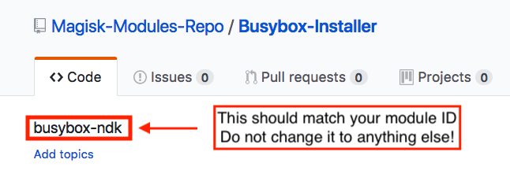

# Magisk Modules and Online Repo
## Magisk Module Format
The Magisk module is a folder under `magisk`, which has a structure as described below:

```
magisk
├── .
├── .
├── a_module                <--- The ID of the module, should match with module.prop
│   ├── auto_mount          <--- If this file exists, auto mount is enabled
│   ├── disable             <--- If this file exists, the module is disabled
│   ├── module.prop         <--- This files stores the indentity and properties of the module
│   ├── post-fs-data.sh     <--- This script will be executed in post-fs-data
│   ├── remove              <--- If this file exists, the module will be removed next reboot
│   ├── service.sh          <--- This script will be executed in late_start service
│   ├── system.prop         <--- This file will be loaded as system props
│   ├── system              <--- If auto mount is enabled, Magisk will "Magic Mount" this folder
│   │   ├── app
│   │   ├── .
│   │   └── .
│   ├── vendor              <--- Auto generated. A symlink to $MODID/system/vendor
│   ├── .                   <--- Any other files/folders are allowed
│   └── .		
├── another_module
│   ├── .
│   └── .
├── .
├── .
```

## Magisk Module Template
The **Magisk Module Template** is hosted **[here](https://github.com/topjohnwu/magisk-module-template)**.

It is a template to create a flashable zip to install Magisk Modules. It is created to be simple to use so that anyone can create their own modules easily. The template itself contains minimal scripting for installation; most of the functions are located externally in [util_functions.sh](https://github.com/topjohnwu/Magisk/blob/master/scripts/util_functions.sh), which will be installed along with Magisk, and can be upgraded through a Magisk upgrade without the need of a template update.

The template should meet most modules' needs. Add files into `system`, which will be cloned into `/system` by Magisk after installing the module, and in addition to module files, `system.prop`, `post-fs-data.sh`, `service.sh` are also installable through this template.

Here are some files you would want to know:

- `config.sh`: A simple script used as a configuration file for the actual installation file to correctly install your module. It is the place you can select which features your module needs/disables.
- `module.prop`: This file contains your module's indentity and properties, including name and versions etc.. This file will be used to identify your module on an actual device and in the [Magisk Modules Repo](https://github.com/Magisk-Modules-Repo)
- `common/*`: These files will be installed to the module with the correspond role
- `META-INF/com/google/android/update-binary`: The actual installation script. Modify this file for advanced custom behavior

## Create a Magisk Module With The Template
1. Clone / download [this repo](https://github.com/topjohnwu/magisk-module-template)
1. Open `config.sh` and carefully read the fully documented file. Follow the instructions within the script
1. You should at least have `config.sh` and `module.prop` modified
1. Directly zip all files; the result zip file is a flashable zip that can be used in both Magisk Manager and custom recoveries
1. Please check [**Notes**](#notes) for several precautions

## Submit Your Module to Magisk Modules Repo
If you want to share your module with others, you can submit your modules to [Magisk Modules Repo](https://github.com/Magisk-Modules-Repo). You would need some basic `git` knowledge here.

1. Create a module as stated above, and test if it works properly
1. Fork [this repo](https://github.com/topjohnwu/magisk-module-template) to your account
1. Commit and push your changes to your forked repo
1. Open an issue in [topjohnwu/Magisk_Repo_Central](https://github.com/topjohnwu/Magisk_Repo_Central/issues/new) with your repo link
1. I will review your module, and once accepted, your repo should be cloned into [Magisk-Modules-Repo](https://github.com/Magisk-Modules-Repo)
1. You should receive an email to become the collaborator so you can edit the repo in the future.

#### Once your module is live on the Modules Repo, the description of your repo should be the ID of your module. Please do NOT change the description, repeat, do NOT change the description.



## Notes
- The Module Template depends on external scripts, be aware of the minimal required Magisk version of the template.
- **Windows users please check here!!** The line endings of all text files should be in the **Unix format**. Please use advanced text editors like Sublime, Atom, Notepad++ etc. to edit **ALL** text files, **NEVER** use Windows Notepad.
- In `module.prop`, `version` can be an arbitrary string, so any fancy version name (e.g. ultra-beta-v1.1.1.1) is allowed. However, `versionCode` **MUST** be an integer. The value is used for version comparison.
- Make sure your module ID **does not contain any spaces**.

## Notes For Repo Developers

- Magisk Manager monitors all repo's `master` branch. Any changes to the branch `master` will be reflected to all users immediately. If you are working on an update for a module, please work on another branch, make sure it works, then finally merge the changes back to `master`.
- Once you finished upgrading your repo, increase at least the `versionCode` in `module.prop`. Magisk Manager uses this value to compare with the local installed module to determine whether an update is availible.
- The description of your repo should be the same as your module ID. If you changed your description, Magisk Manager will fail to identify your repo, and cannot relate installed module to the online repo together.