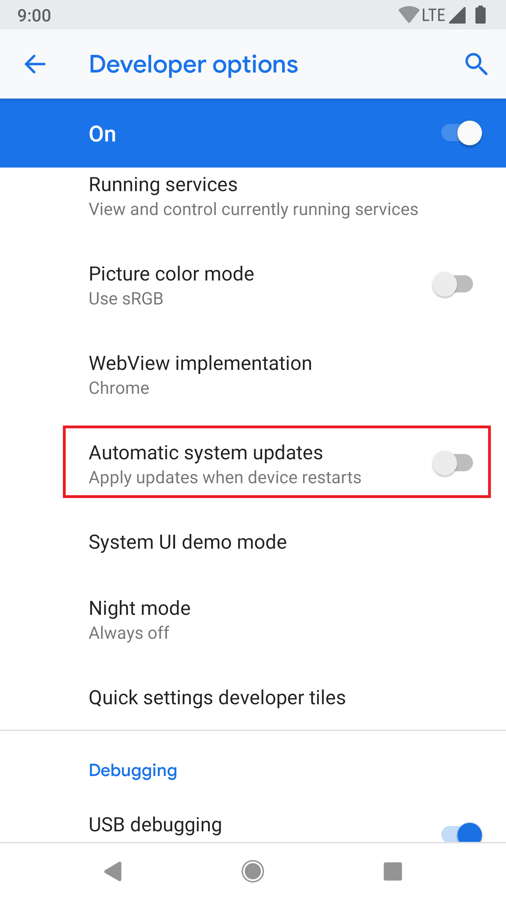
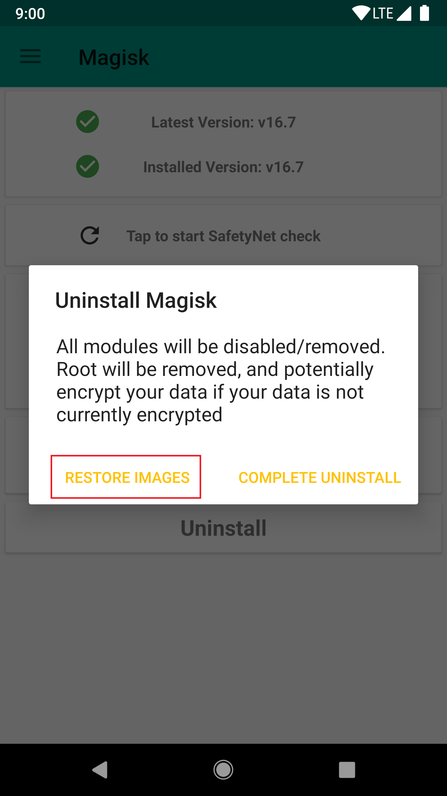
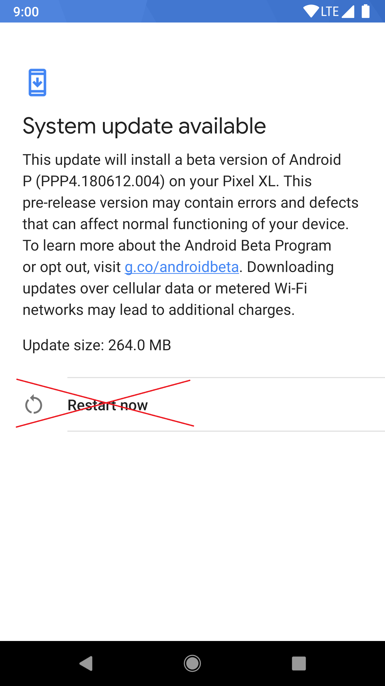
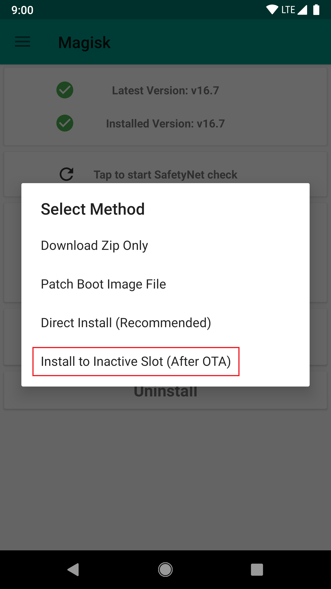
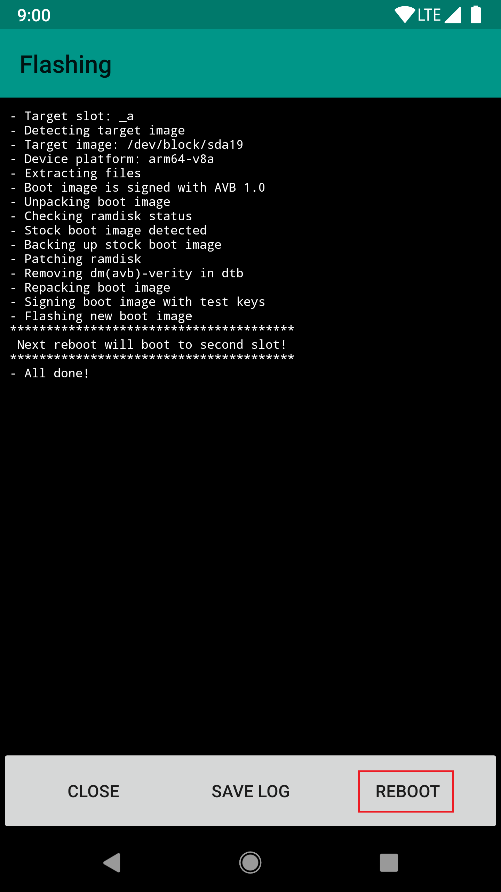

# NOTE: Install to Inactive Slot is disabled in newer builds of the Magisk app due to changes that Google introduced to the OTA process: https://twitter.com/topjohnwu/status/1303574238796808192

## OTA Upgrade Guides
Magisk does not modify most read-only partitions, which means applying official OTAs is much simpler. Here are the tutorials for several different kind of devices to apply OTAs and preserve Magisk after the installation (if possible). This is just a general guide as procedures for each device may vary.

**NOTE: In order to apply OTAs, you HAVE to make sure you haven't modified and read-only partitons yourself (such as `/system` or `/vendor`) in any way. Even remounting the partition to rw will tamper block verification!!**

### Prerequisites
- Please disable *Automatic system updates* in developer options, so it won't install OTAs without your acknowledgement.

- When an OTA is available, first go to (Magisk app → Uninstall → Restore Images). **Do not reboot or you will have Magisk uninstalled.** This will restore partitions modified by Magisk back to stock from backups made at install in order to pass pre-OTA block verifications. **This step is required before doing any of the following steps written below!**

### Devices with A/B Partitions

It is possible to have the OTA installed to the inactive slot and have the Magisk app install Magisk onto the updated partitions. The out-of-the-box OTA installation works seamlessly and Magisk can be preserved after the installation.

- After restoring stock images, apply OTAs as you normally would (Settings → System → System Update).
- Wait for the installation to be fully done (both step 1 and step 2 of the OTA), **do not press the "Restart now" or "Reboot" button!** Instead, go to (Magisk app → Install → Install to Inactive Slot) to install Magisk to the updated slot.

 

- After installation is done, press the reboot button in the Magisk app. Under-the-hood, the Magisk app forces your device to switch to the updated slot, bypassing any possible post-OTA verifications.

### "Non A/B" Devices
Unfortunately, there are no real good ways to apply OTAs on these devices. The following tutorial will not preserve Magisk; you will have to manually re-root your device after the upgrade, and this will require access to a computer. These are simply "best practices".

- To properly install OTAs, you must have your stock recovery installed on your device. If you have custom recovery installed, you can restore it from your previous backup, or dumps found online, or factory images provided by OEMs.
If you decide to start by installing Magisk without touching your recovery partition, you have a few choices, either way you will end up with a Magisk rooted device, but recovery remains stock untouched:
    - If supported, use `fastboot boot <recovery_img>` to boot the custom recovery and install Magisk.
    - If you have a copy of your stock image dump, install Magisk by using the Magisk app's "patch images" feature
- Once you restored back to stock recovery and other images, download the OTA. Optionally, once you have downloaded the OTA update zip, find a way to extract the zip (as it usually involved root)
- Apply the OTA and reboot your device. This will use the official stock OTA installation mechanism of your device to upgrade your system.
- Once it's done you will be left with an upgraded, 100% stock, un-rooted device. You will have to manually flash Magisk back. Consider using the methods stated in step 1. to flash Magisk without touching the recovery partition if you want to receive stock OTAs frequently.
