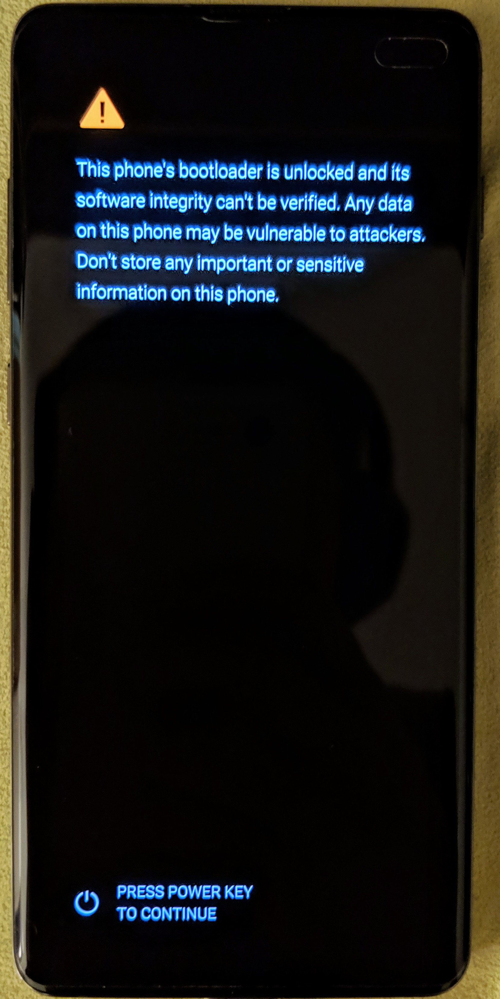

## Samsung

#### Note: This guide is ONLY for Samsung devices launched with Android Pie (9.0) pre-installed, which currently includes the S10 series and A50. If you have an older device, please follow the general installation guide. Your device must also have an unlockable bootloader, which means in practice that all Exynos devices are supported, whilst those manufactured for the Northern American market (with Snapdragon SOCs), are not.

### Before Installing Magisk

- Installing Magisk **WILL** trip KNOX
- Installing Magisk for the first time **REQUIRES** a full data wipe, backup before continue
- You have to have your bootloader unlocked before following the instructions
- Magisk has to be installed to the **recovery** partition of your device, which is **very** different from what you used to know about rooting in general

### Unlocking Bootloader

Normally I won't provide instructions for this, but since things had changed drastically from previous Samsung devices, and there are some details that many might not know, I figure this would be helpful.
- Allow bootloader unlocking in Developer options → OEM unlocking
- Power off your device. Press *Bixby + Volume Down* and plug in your device to a PC to boot into download mode
- Long press volume up to unlock the bootloader. **This will wipe your data and automatically reboot.**

Just when you think the bootloader is unlocked, surprise surprise, it is *actually* not! Samsung introduced `VaultKeeper` in the system, meaning the bootloader will reject any unofficial partitions before `VaultKeeper` explicitly allows it.

- Go through the initial setup. Skip through all the steps since data will be wiped again later when we are installing Magisk. **Connect the device to internet in the setup though!**
- Enable developer options, and **confirm that the OEM unlocking option exists and grayed out!** The `VaultKeeper` service will unleash the bootloader after it confirms that the user has the OEM unlocking option enabled. This step is to simply make sure the service gets the correct info, and also double check that our device is in a correct state
- Your bootloader now accepts unofficial images in download mode, a.k.a actual bootloader unlocked :D. Follow on to read the rest of this guide.

### Magisk in Recovery

Because the recovery part is confusing, let me explain it in more detail. To boot to a system with Magisk, you will have to **boot to recovery every time**. Because both Magisk and recovery lives in the same partition, what you end up when booting into recovery will be determined by **how long you press volume up**.

After installing Magisk to the recovery partition, when you choose to boot to recovery, by default it will boot to the system with Magisk enabled. If you want to actually boot to recovery and not Magisk, continue holding the volume up button until you see the recovery screen. This might sound confusing but please keep following along.

After you unlock the bootloader, every time the device powers on, you will see the following splash screen:

The bootloader decides where to boot before the warning splash screen, either it be `system`, `recovery` or `download`. This means you actually only need to hold the *Bixby + Volume Up* button combo till you see the splash screen if you want to boot to the recovery partition.

**All words in summary, after installing Magisk:**
- **(Powering up normally) → (System with no Magisk)**
- **(Power + Bixby + Volume Up) → (Bootloader warning) → (Release all buttons) → (System with Magisk)**
- **(Power + Bixby + Volume Up) → (Bootloader warning) → (Keep holding volume up) → (Actual recovery)**

### Instructions

Now after reading all the info above, here are the instructions:

1. Download the firmware for your device.
2. Unzip the firmware and copy the **AP** tar file to your device. It is normally named as `AP_[device_model_sw_ver].tar.md5`
3. Install Magisk Manager from the [Canary Channel](https://raw.githubusercontent.com/topjohnwu/magisk_files/master/canary_builds/app-release.apk)
4. In Magisk Manager: Install → Install → Select and Patch a File
5. Select the **AP** tar file. Magisk Manager will patch the whole firmware file and store the output to `[Internal Storage]/Download/magisk_patched.tar`
6. Copy the tar file to your PC, and boot your device to download mode.
7. Flash `magisk_patched.tar` as AP in ODIN   **Important: Uncheck "Auto Reboot" in Options!!!!**
8. Magisk is now successfully flashed to your device! But there are still several steps before you can properly use the device.
9. We now want to boot into the stock recovery to factory reset our device.  
**Full data wipe is mandatory! Do not skip this step.**  
Press *Power + Volume Down* to exit download mode, and as soon as the screen turns off, immediately press *Power + Bixby + Volume Up* to boot to recovery partition. Just as mentioned in the previous section, since we want to boot into stock recovery, **continue pressing the volume up button until you see the stock recovery screen**.
10. In the stock recovery menu, use volume buttons to navigate through menus, and the power button to select the option. Select *Wipe data/factory reset* to wipe the data of the device.
11. This time, we can finally boot to the system with Magisk. Select *Reboot system now*, and immediately press *Power + Bixby + Volume Up*. After seeing the bootloader warning screen, release all buttons so it can boot to the system.
12. The device will automatically reboot for the first time it boots. This is completely normal and done by design.
13. After the device is booted up, do the usual initial setup. **The following steps will need internet connection.**
14. You shall see Magisk Manager in your app drawer; if not, manually install the APK you downloaded in step 3 and continue to the next step. The app would be a stub and it shall automatically upgrade to the full Magisk Manager when you open it.
15. Magisk Manager will ask to do additional setups. Let it do its job and the app will automatically reboot your device.
16. Voila! Enjoy Magisk :)

### Final Words
- You can directly upgrade Magisk within Magisk Manager without an issue. **Flashing in custom recovery is not supported for now.** I'm still not sure how to properly add support for flashing Magisk to recovery in custom recoveries.
- Magisk actually patches 3 partitions on your device:
    - `vbmeta`: replace with empty vbmeta image to disable partition verification
    - `boot`: remove the signature of the image to prevent soft bricks
    - `recovery`: this is where Magisk is actually installed
- **Never, ever** try to restore either of the 3 images mentioned back to stock! You can easily brick your device by doing so, and the only way out is to do full ODIN restore following with factory reset. Just don't do it.
- If you want to upgrade your device, **never** flash the stock **AP** tar file with reasons mentioned above. **Always** pre-patch the firmware before flashing in ODIN.

#### Check the [XDA Post](https://forum.xda-developers.com/galaxy-s10/development/magisk-root-galaxy-s10-series-t3918699) for more technical details
