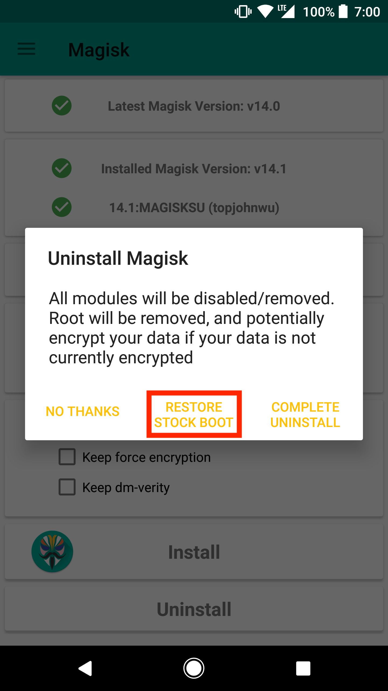
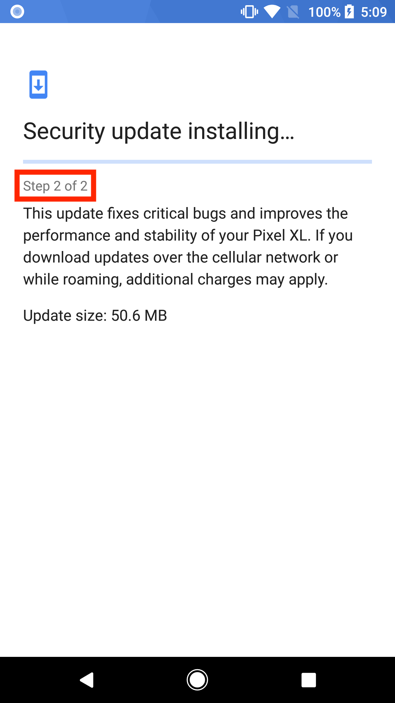
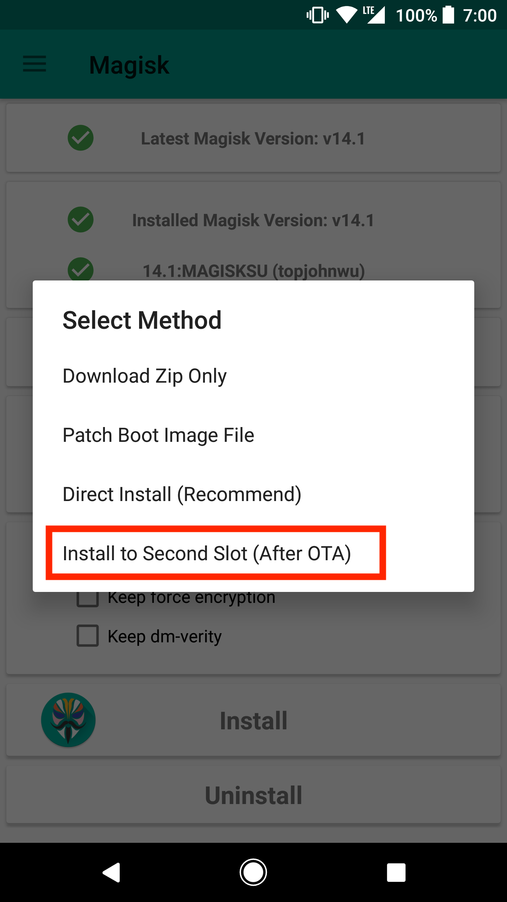

# Tips and Tricks

## OTA Installation Tips
Magisk do modifications systemless-ly, which means applying official OTAs is much simpler. Here I provide a few tutorials for several different kind of devices to apply OTAs and preserve Magisk after the installation if possible.

**This tutorial is only for Magisk v14.1+**

**NOTE: In order to apply OTAs, you HAVE to make sure you haven't modified `/system` (and `/vendor` if available) in anyway, even remounting the partition to rw will tamper block verification!!**

#### Prerequisites
1. Please disable *Automatic system updates* in developer options, so it won't install OTAs without your acknowledgement.  
    
1. When an OTA is available, please go to Magisk Manager → Uninstall → Restore Stock Boot. **Do not reboot immediately or you will have Magisk uninstalled.** This will restore your boot back to 100% untouched stock boot image in order to pass boot verification. **This step is required before doing any of the following steps written below!**  
    

#### Devices with A/B Partitions
(Includes Pixel family)

Due to the fact that these devices have two separate partitions and the OTA installation happens live when the system is still running, these devices have the best support: the out-of-the-box OTA installation works seamlessly and Magisk will be preserved after the installation.

1. After restoring stock boot image, apply OTAs as you normally would (Settings → System → System Updates)
1. Once the installation passed step 1 and starting step 2, go to Magisk Manager → Install → Install to Second Slot. This will install Magisk into the second boot image slot, which is the updated slot.  
     
1. Let the OTA finish its job. After a reboot, the bootloader will switch to the updated system. Magisk should still be installed since we already patched the new boot image.

#### Devices with FlashFire Support
(Includes Pixel family, Nexus family, Samsung devices)  
(If you are using a device with A/B partitions, I **strongly** recommend you to use the method stated above since it uses the stock OTA installation mechanism and will always work under any circumstances)

The [FlashFire](https://play.google.com/store/apps/details?id=eu.chainfire.flash) app developed by Chainfire is a great app to apply OTAs and preserve root at the same time. However, whether it supports your device/system combination depends on the application itself, and support may also change in the future. If you face any issues, please directly [report to Chainfire](https://forum.xda-developers.com/general/paid-software/flashfire-t3075433).  

1. After restoring the stock boot image, download the OTA (Settings → System → System Updates), **do not press reboot to install.**
1. Open FlashFire, it should detect your OTA zip. Select OK in the popup dialog to let it do its setup.
1. Please use the options shown in the screenshot below. The key point is to disable EverRoot (or it will install SuperSU), and add a new action to flash Magisk zip **after** the OTA update.zip (the update.zip is auto generated in the previous step).  
    
1. Press the big **Flash** button, after a few minutes it should reboot updated with Magisk installed.

#### Other Devices - General Case
Unfortunately, there are no real good ways to apply OTAs on all devices. Also, the tutorial provided below will not preserve Magisk - you will have to manually re-root your device after the upgrade, and this will require PC access. Here I share my personal experience with my daily driver - HTC U11.

1. To properly install OTAs, you should have your stock recovery installed on your device. If you have custom recovery installed, you can restore it from your previous backup, or dumps found online, or factory images provided by OEMs.  
If you decide to start by installing Magisk without touching your recovery partition, you have a few choices, either way you will end up with a Magisk rooted device, but recovery remain stock untouched:
    - If supported, use `fastboot boot <recovery_img>` to boot the custom recovery and install Magisk. 
    - If you have a copy of your stock boot image dump, install Magisk by patching boot image via Magisk Manager, and manually flash it through download mode / fastboot mode / Odin
1. Once your device have stock recovery and stock boot image restored, download the OTA. Optionally, once you downloaded the OTA update zip, you can find a way to copy the zip out since you are still rooted. Personally I will extract the stock boot image and recovery image from the OTA zip for future usage (to patch via Magisk Manager or restore stock recovery etc.)
1. Apply and reboot your device. This will use the official stock OTA installation mechanism of your device to upgrade your system.
1. Once it's done you will be left with an upgraded, 100% stock, un-rooted device. You will have to manually flash Magisk back. Consider using the methods stated in step 1. to flash Magisk without touching the recovery partition if you want to receive stock OTAs frequently.

## Remove Files
How to efficiently remove a file systemless-ly? To actually make the file **disappear** is complicated (possible, not worth the effort). **Replacing it with a dummy file should be good enough**! Create an empty file with the same name and place it in the same path within a module, it shall replace your target file with a dummy file.

## Remove Folders
Same as mentioned above, actually making the folder to **disappear** is not worth the effort. **Replacing it with an empty folder should be good enough**! A handy trick for module developers using [Magisk Module Template](https://github.com/topjohnwu/magisk-module-template) is to add the folder you want to remove into the `REPLACE` list within `config.sh`. If your module doesn't provide a correspond folder, it will create an empty folder, and automatically add `.replace` into the empty folder so the dummy folder will properly replace the one in `/system`.