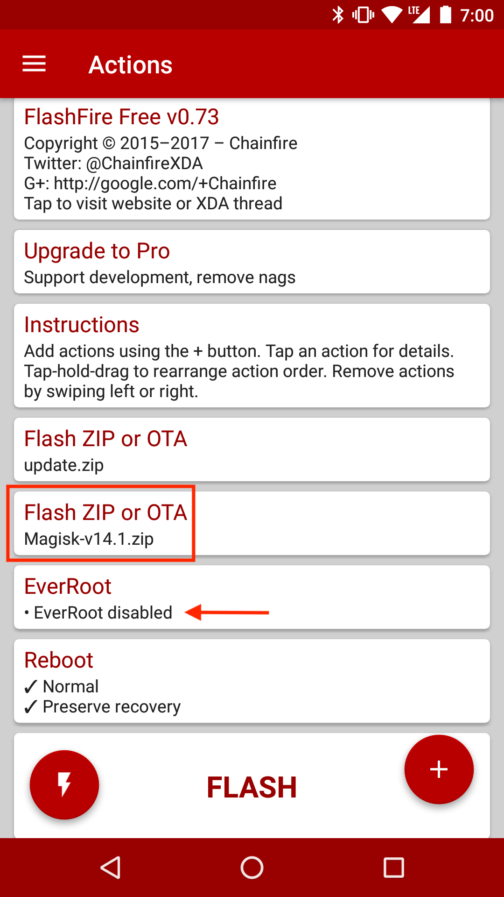
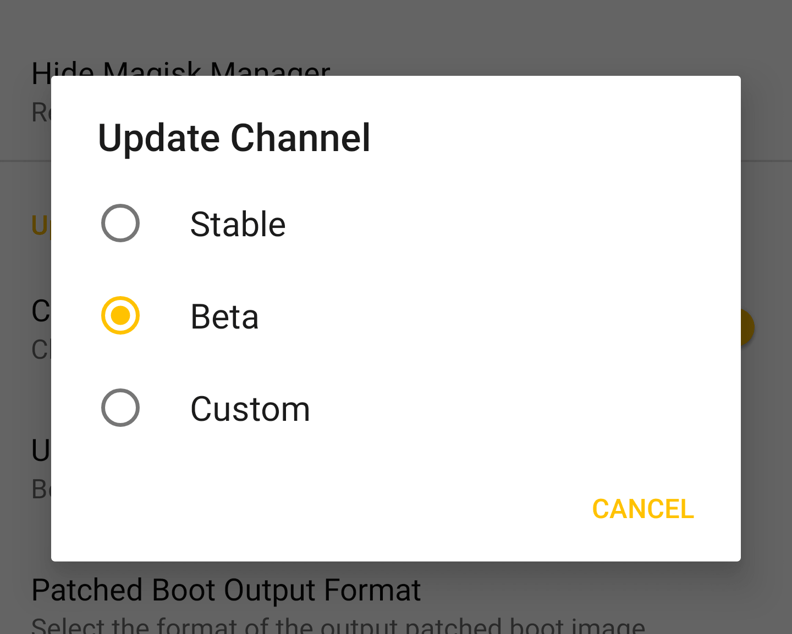
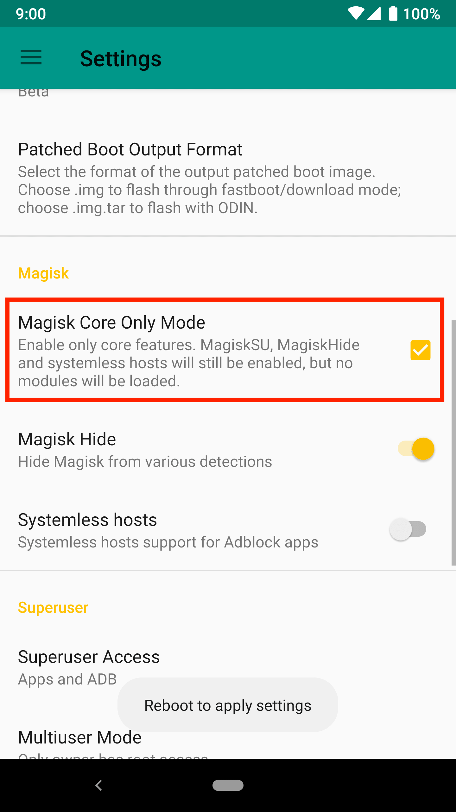
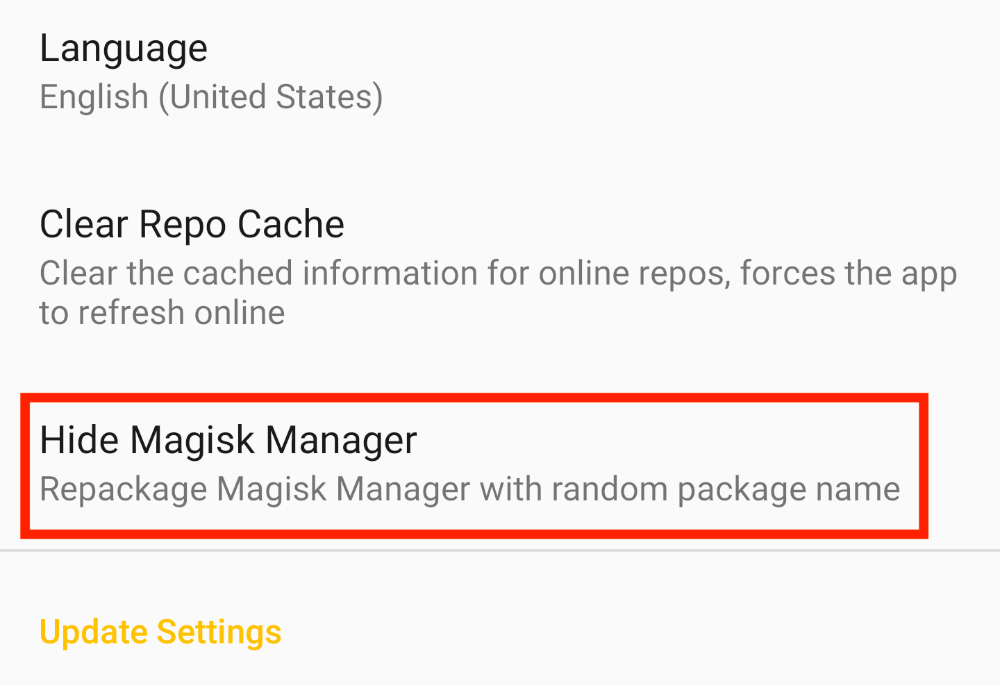

# Tutorials

## OTA Installation
Magisk does modifications systemless-ly, which means applying official OTAs is much simpler. Here I provide a few tutorials for several different kind of devices to apply OTAs and preserve Magisk after the installation if possible.

**This tutorial is only for Magisk v17.0+**

**NOTE: In order to apply OTAs, you HAVE to make sure you haven't modified `/system` (and `/vendor` if available) in any way. Even remounting the partition to rw will tamper block verification!!**

### Prerequisites
- Please disable *Automatic system updates* in developer options, so it won't install OTAs without your acknowledgement.

- When an OTA is available, first go to (Magisk Manager → Uninstall → Restore Images). **Do not reboot or you will have Magisk uninstalled.** This will restore your boot (and dtbo if applicable) back to 100% untouched stock images in order to pass pre-OTA block verifications. **This step is required before doing any of the following steps written below!**

### Devices with A/B Partitions

Due to the fact that these devices have two separate partitions, it is possible to have the OTA installed to the inactive slot and have Magisk Manager to install Magisk onto the updated partition. The out-of-the-box OTA installation works seamlessly and Magisk can be preserved after the installation.

- After restoring stock boot image, apply OTAs as you normally would (Settings → System → System Update).
- Wait for the installation to be fully done (both step 1 and step 2 of the OTA), **do not press the "Restart now" or "Reboot" button!** Instead, go to (Magisk Manager → Install → Install to Inactive Slot) and install Magisk to the slot that the OTA engine just updated.

 

- After installation is done, press the reboot button in Magisk Manager. Under-the-hood Magisk Manager forces your device to switch to the updated slot, bypassing any possible post-OTA verifications.

- After the reboot, your device should be fully updated, and most importantly, Magisk is still installed to the updated system!

### Devices with FlashFire Support
(If you are using a device with A/B partitions, I **strongly** recommend you to use the method stated above since it uses the stock OTA installation mechanism and will always work under any circumstances)

The [FlashFire](https://play.google.com/store/apps/details?id=eu.chainfire.flash) app developed by Chainfire is a great app to apply OTAs and preserve root at the same time. However, there is a very high chance that it does not support your device/system combination, and unfortunately the app is no longer maintained by Chainfire so no additonal compatibility would be added in the future.

- After restoring the stock boot image, download the OTA (Settings → System → System Updates), **do not press reboot to install.**
- Open FlashFire, it should detect your OTA zip. Select OK in the popup dialog to let it do its setup.
- Please use the options shown in the screenshot below. The key point is to disable EverRoot (or it will install SuperSU), and add a new action to flash Magisk zip **after** the OTA update.zip (the update.zip should be auto generated in the previous step).

- Press the big **Flash** button, after a few minutes it should reboot and updated with Magisk installed.

### Legacy "Non A/B" Devices - General Case
Unfortunately, there are no real good ways to apply OTAs on these devices. The following tutorial will not preserve Magisk - you will have to manually re-root your device after the upgrade, and this will require PC access. This is a general "best practice".

- To properly install OTAs, you must have your stock recovery installed on your device. If you have custom recovery installed, you can restore it from your previous backup, or dumps found online, or factory images provided by OEMs.
If you decide to start by installing Magisk without touching your recovery partition, you have a few choices, either way you will end up with a Magisk rooted device, but recovery remains stock untouched:
    - If supported, use `fastboot boot <recovery_img>` to boot the custom recovery and install Magisk.
    - If you have a copy of your stock boot image dump, install Magisk by patching boot image via Magisk Manager, and manually flash it through download mode / fastboot mode / Odin.
- Once your device has stock recovery and stock boot image restored, download the OTA. Optionally, once you have downloaded the OTA update zip, you can find a way to copy the zip out, since you are still rooted. Personally, I extract the stock boot image and recovery image from the OTA zip for future usage (to patch via Magisk Manager or restore stock recovery etc.)
- Apply and reboot your device. This will use the official stock OTA installation mechanism of your device to upgrade your system.
- Once it's done you will be left with an upgraded, 100% stock, un-rooted device. You will have to manually flash Magisk back. Consider using the methods stated in step 1. to flash Magisk without touching the recovery partition if you want to receive stock OTAs frequently.

## Best Practices for MagiskHide
There are a lot of people confused about why their setup isn't bypassing detections as expected. Here are some of the best practices to maintain a proper environment for MagiskHide. The guidelines in the following is ordered in progression, you might not need to do everything all the way through, but you should have done previous steps before going on to the next step.

If you've followed all practices below and still cannot succeed, consider switching to the beta channel as new MagiskHide upgrades might have not come to the stable channel yet.

Settings → Update Settings → Update Channel

Let's start with SafetyNet.

- Check SafetyNet status with Magisk Manager. Google banned the usage of old APIs, and many "SafetyNet Detection" apps you used were never updated and thus cannot provide correct information. **Trust the SafetyNet check included in Magisk Manager!**
- Start clean: my advice is always the easy route - **use stock ROMs**. If you prefer custom ROMs, choose stable, official builds from well-reputed teams.
- If you cannot even pass **basicIntegrity**, there are some serious issues! Even though in theory Magisk Modules can be hidden by MagiskHide, you should first try enabling *Core-Only Mode* and see if it makes any difference. If it still doesn't pass, the ROM you're using is the problem. If it passes, experiment and narrow down the problematic module(s).

- If **basicIntegrity** passes but **ctsProfile** doesn't, you might be using a ROM that has never passed CTS (OEM betas, previews, China based ROMs etc.). Try out [MagiskHide Props Config](https://forum.xda-developers.com/apps/magisk/module-magiskhide-props-config-t3789228) from @Didgeridoohan and switch a known CTS-passing fingerprint from the massive list included in the module. You will be very surprised by the results!

At this point, SafetyNet should be fully passed. Let's change gears to notorious apps that detects all kinds of weird shit.

This is just so pleasing to look at, right?

- Add your target app to the MagiskHide list: go to the "MagiskHide" section in Magisk Manager, and check the app you want to hide. **Do not abuse MagiskHide!** I've seen some paranoid people adding *a lot* of unnecessary apps to the list. This behavior is very likely to not only break MagiskHide, **but also Magisk itself or even the whole system** (`magiskd`/`magisklogd` crashes, system bogged down). Remember: with the current MagiskHide implementation, **each additional hide target comes with a large cost**; only enable those you are SURE you needed!
- Hide Magisk Manager: go to (Settings → Hide Magisk Manager) to repackage the app with a random package name.

- Remove sensitive apps: after dealing with Magisk Manager, uninstall Xposed Installer, Lucky Patcher, other root managers, anything you think is suspicious.
- Remove sensitive files: starting from Magisk Manager v5.9.0, `/sdcard/MagiskManager` is no longer used. Remove that specific folder if exists, and then remove any files and folders that have sensitive names (e.g. magisk, supersu, xposed etc.) in your internal storage. Yes, there are apps scanning through all your files, are you freaking out now?
- Disable USB debugging (ADB): some apps does not allow your device to have usb debugging enabled. Disable it in developer options.
- Disable developer options: it's just ridiculous at this point.
- Uninstall Magisk Manager: this is the last thing you should try. Sometimes the hiding technique used in Magisk Manager is just not good enough (it is improving, like recently added code obfuscation), try uninstalling and see if it works. If it does, report to me and I will hack up a solution ASAP.

